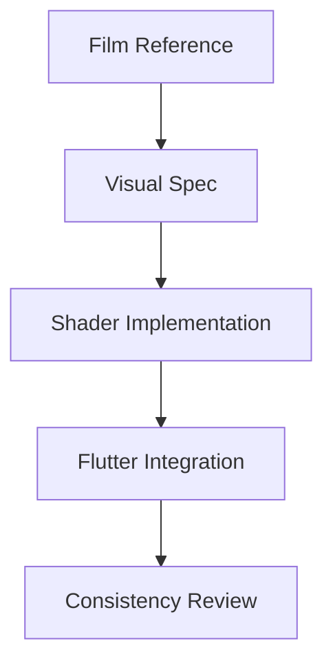

## 🎓 Plan of Study — Spec-Driven Shader Authoring

A practical, art-driven roadmap connecting **film analysis** → **visual specifications** → **shader implementation** → **Flutter integration**.

---

## Core Loop

**Reference → Spec → Shader → Embed → Review**

Progression is gated by **spec clarity**, not visual flash.

---

## Core Practice: Visual → Shader Specification

Every shader in this study begins with a short written spec.

A shader spec defines:
- **Intent** — the visual or emotional effect being targeted
- **Inputs** — uniforms, ranges, defaults, and interaction points
- **Constraints** — platform (WebGL2 / GLSL ES 3.00), precision, performance expectations
- **Acceptance Criteria** — how you know the shader is “correct”
- **Non-Goals** — what the shader is explicitly not trying to do

No shader is written without a spec.  
Iteration refines the implementation; the spec changes only when intent changes.

---

## 🗺️ Visual–Shader Roadmap

---

## Phase 1 – Visual Language & Spec Writing

**Deliverable:** visual specs, not shaders.

- Analyze film scenes using the Visual Study Notebook
- Describe:
  - color relationships
  - contrast
  - framing
  - emotional tone
- For each reference, write a **visual spec**:
  - what the effect should do
  - what the viewer should notice
  - what must remain stable

**No GLSL yet.**

---

## Phase 2 – Spec → Shader Translation

**Deliverable:** shaders that satisfy written specs.

For each visual spec:
- Translate it into a **shader spec**:
  - uniforms and ranges
  - coordinate assumptions
  - expected behavior
- Implement the shader in GLSL ES 3.00
- Validate:
  - does the output match the spec?
  - are parameters predictable?

Shaders that “look cool” but violate the spec are **not complete**.

---

## Phase 3 – Spec-Preserving Flutter Integration

**Deliverable:** embedded shaders that still satisfy their specs.

- Integrate shaders via Flutter’s shader APIs
- Apply them to:
  - cards
  - backgrounds
  - overlays
- Test dynamic states:
  - hover
  - selection
  - transitions

If embedding breaks intent, **fix the integration**, not the spec.

---

## Phase 4 – Cross-Shader Consistency

**Deliverable:** a shared visual spec.

- Define a **shader style guide**:
  - color usage
  - motion limits
  - timing rules
- Audit shaders against the guide
- Reduce visual noise and accidental variation

The goal is a **coherent visual system**, not individual effects.

---

## Completion Criteria

You are done when you can:

- Write a clear spec from a film still
- Predict shader behavior before coding
- Change parameters without breaking intent
- Embed shaders without altering meaning
- Explain *why* a shader works, not just how

At this point, you are practicing **deliberate shader authorship**, not experimentation.
