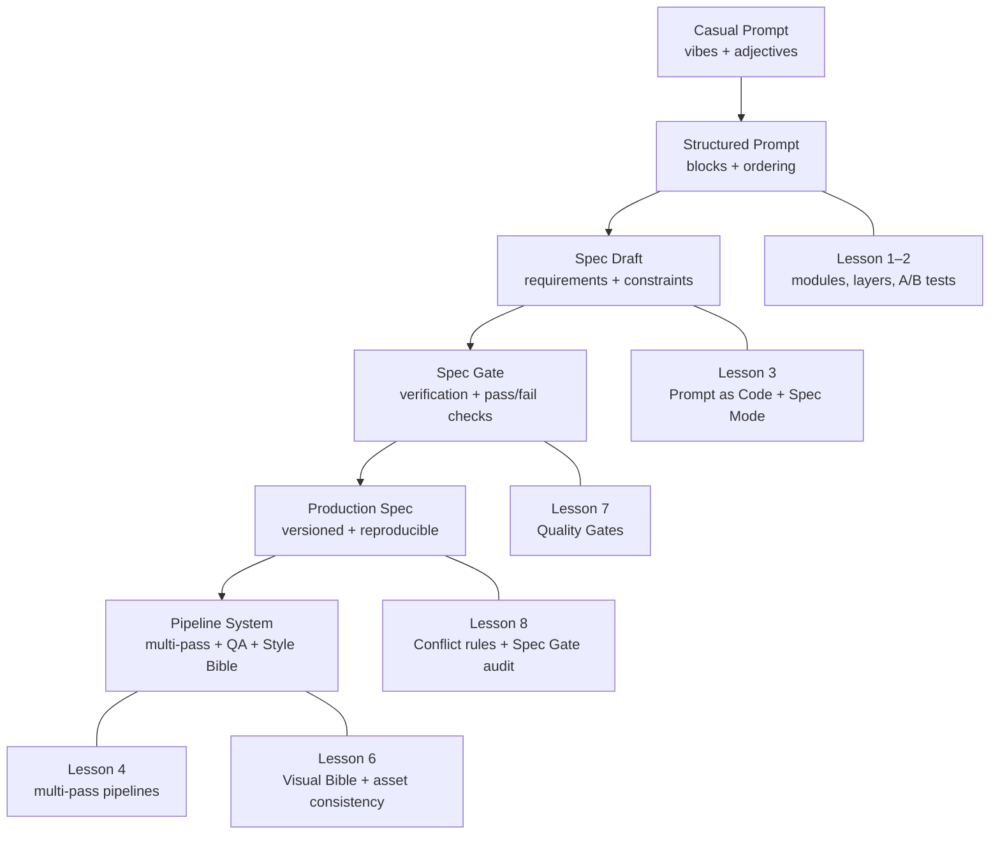

# 🧭 AI Art Prompt-Engineering Study Plan
### Procedural Creativity • Visual Pipelines • Modular Design & Spec Thinking

> **Prompt → Spec Design**
>  
> In this study plan, *prompt-engineering* is treated as a progression:  
> we begin with exploratory prompts and graduate toward reproducible, verifiable **specs**.

👉 See RESOURCES in [`RESOURCES.md`](RESOURCES.md)  
👉 See ART_SUMMARIES in [`ART_SUMMARIES.md`](ART_SUMMARIES.md)  


> **Note:** Specs start rough on purpose. They are explored in pipelines first, then tightened and enforced through QA and K.E.R.N.E.L review as the system matures.

**Legend:**  
- 🛠 **PE** = Prompt-engineering–specific (model/automation knobs)  
- 🎨 **ART** = General art & design craft (composition, color, print)  
- 🔁 **BOTH** = Useful in both prompt-engineering and general art workflow  

**Progress legend:**  
- `[ ]` = not started  
- `[▶]` = in progress / currently working on  
- `[✓]` = done  

---

## Table of Contents

- [Quick Tracks (Choose Your Path)](#quick-tracks-choose-your-path)
- [Minimal 2-Week Path (KERNEL – “Keep It Simple”)](#minimal-2-week-path-kernel--keep-it-simple)
- [Study Meta-Constraints (for Yourself)](#study-meta-constraints-for-yourself)
- [Learning outcomes](#learning-outcomes)

- [Lesson 1 – Foundations · Thinking in Modules](#lesson-1--foundations--thinking-in-modules)
- [Lesson 2 – Style & Surface · Visual Semantics](#lesson-2--style--surface--visual-semantics)
- [Lesson 3 – Prompt as Code · Macro Thinking](#lesson-3--prompt-as-code--macro-thinking)
- [Lesson 4 – Advanced Pipelines](#lesson-4--advanced-pipelines)
- [Lesson 5 – Print-Ready Thinking](#lesson-5--print-ready-thinking)
- [Lesson 6 – Visual Bible & Asset Library](#lesson-6--visual-bible--asset-library)
- [Lesson 7 – Quality Gates & Review](#lesson-7--quality-gates--review)
- [Lesson 8 – K.E.R.N.E.L Retrospective Exercise](#lesson-8--kernel-retrospective-exercise)
- [Lesson 9 – Prompt Pipes & Function Chaining (Optional / Advanced)](#lesson-9--prompt-pipes--function-chaining-optional--advanced)
- [Lesson 10 – Future Directions (Advanced Study · Optional)](#lesson-10--future-directions-advanced-study--optional)

- [Appendix A – Workflow Hygiene (Git-First)](#appendix-a--workflow-hygiene-git-first)
- [Appendix B – Macro Header Template (Example Utala)](#appendix-b--macro-header-template-example-utala)
- [Appendix C – Layered Prompt Example (JSON)](#appendix-c--layered-prompt-example-json)
- [Appendix D – Learning Outcomes to Professional Practices](#appendix-d--learning-outcomes-to-professional-practices)
- [Appendix E – Model Cheatsheet (Quick Tuning Notes)](#appendix-e--model-cheatsheet-quick-tuning-notes)
- [Appendix F – Composition-First Prompt Ordering (Example)](#appendix-f--composition-first-prompt-ordering-example)
- [Appendix G – Core Artistic Principles (Essentials)](#appendix-g--core-artistic-principles-essentials)
- [Appendix H – K.E.R.N.E.L Prompt Framework (Summary – Copy Block)](#appendix-h--kernel-prompt-framework-summary--copy-block)
- [Appendix I – Engineering Patterns on a New Substrate](#appendix-i--engineering-patterns-on-a-new-substrate)
- [Appendix J – Assistant Notes (for future runs)](#appendix-j--assistant-notes-for-future-runs)

---

## Quick Tracks (Choose Your Path)

**Core Prompt Engineer Track (minimal art fundamentals)**  
- Lessons: **1, 2, 3, 4, 6, 7**  
- Appendices: **B, C, E, H, I, J**  

**Art-First Track (artist learning PE)**  
- Lessons: **1, 2, 5, 6, 7**  
- Appendices: **G, H, I, J**  

> You can mix, but pick a *primary* track so each pass through the plan feels focused.

---

## Minimal 2-Week Path (KERNEL – “Keep It Simple”)

**Week 1**  
- **Day 1–2:** Lesson 1 – Exercises 1–3  
- **Day 3–4:** Lesson 2 – Exercises 1–3  
- **Day 5–7:** Lesson 3 – Exercises 1–3  

**Week 2**  
- **Day 8–10:** Lesson 4 – Exercises 1 & 4  
- **Day 11–12:** Lesson 6 – Exercises 1–3  
- **Day 13–14:** Lesson 7 – Full checklist + KERNEL summary exercise (see end)

If time is tight: **do only the minimal path**, then loop back later for the rest.

---

## Study Meta-Constraints (for Yourself)

To stay KERNEL-aligned, treat your study time like a prompt:

- **Session length:** 45–90 minutes max.  
- **Change budget per experiment:** change **≤ 2 variables per run**.  
- **Concept budget per session:** introduce **≤ 1 new core concept** (e.g., “attention weighting”, “seed branching”).  
- **Lesson gating:** don’t move to the next lesson until you can state its **learning outcome in your own words** and meet its **completion criteria**.

---

## Learning outcomes

By the end of this plan you will be able to:

- 🔁 Think and build prompts like a procedural designer — compose prompts as modular, reusable systems.
- 🔁 Maintain visual consistency across long projects — apply a Style Bible and asset discipline to avoid drift.
- 🔁 Prototype and iterate with version control discipline — track changes in **git**, document deltas, and record seeds where supported.
- 🔁 Treat **STYLE**, **MOOD**, and **TEXTURE** as modular layers — toggle, test, and combine them independently.
- 🔁 Output print-ready, reproducible visuals — produce assets that meet production and reproduction constraints.

---

## **Lesson 1 – Foundations · Thinking in Modules**
**Goal:** understand how DALL·E (and similar models) interpret structured language.

**Concepts**
- 🛠 **PE** Core modules: `[COMPOSITION]`, `[SUBJECT]`, `[STYLE]`, `[COLOR]`, `[TEXTURE]`, `[LIGHTING]`, `[MOOD]`, `[DETAILS]`, `[OUTPUT]`.
- 🎨 **ART** Geometry constraints · ratio statements · symmetry.
- 🔁 **BOTH** Vocabulary seeding · style tokens.
- 🔁 **BOTH** Reference-anchored prompting · seed reuse (where supported).
- 🔁 **BOTH** STYLE / MOOD / TEXTURE as independent toggleable layers.

### 🔁 Milestone: When a prompt becomes a spec
In this plan, you “cross the line” from casual prompting to **spec-writing** when your prompt includes:

- **Hard constraints** (must/must not; measurable limits like “≤ 72 chars”, “only 1 focal zone”)
- **Negative constraints** (explicit “do not add / avoid” list)
- **Acceptance checks** (examples that should pass/fail, or a checklist to verify output)
- **Stable structure** (reusable blocks like [COMPOSITION]...[OUTPUT])

Rule of thumb:
- **Prompt = instruction**
- **Spec = contract (requirements + constraints + how to verify)**

You’ll start writing *true specs* consistently by **Lesson 3** (Prompt as Code) and you’ll operationalize them in **Lesson 7** (Quality Gates).

**Exercises**
1. `[✓]` 🛠 **PE** Write one prompt using all core blocks.  
2. `[✓]` 🔁 **BOTH** Generate three images changing **only [COLOR]** (A/B test discipline).  
3. `[✓]` 🎨 **ART** Write geometry specs (e.g., “object = ¼ canvas height”).  
4. `[✓]` 🔁 **BOTH** Upload a reference; vary one structural parameter.  
5. `[✓]` 🔁 **BOTH** Observe visual drift when STYLE / MOOD / TEXTURE are toggled individually.  

**Completion criteria (KERNEL – Easy to Verify)**  
- You can point to **one prompt** and highlight each core block `[COMPOSITION]` … `[OUTPUT]`.  
- You can show a **3-image set** where only COLOR changed, and explain the difference without mentioning style/lighting changes.  
- You can describe your geometry constraints in words *and* see them reflected in the output (e.g., subject consistently at ¼ canvas height).  

👉 See full detail in [`LESSON_1_NOTES.md`](LESSON_1_NOTES.md)
---

## **Lesson 2 – Style & Surface · Visual Semantics**
**Goal:** develop control over aesthetics and surface feel.

**Concepts**
- 🔁 **BOTH** Reversible layers: STYLE ↔ TEXTURE ↔ MOOD.  
- 🎨 **ART** Color harmony · value mapping · grayscale readability.  
- 🎨 **ART** Texture vocab: distressed / halftone / risograph / grain.  
- 🎨 **ART** Lighting direction · material realism.  
- 🎨 **ART** **Lighting micro-glossary** (key/fill/rim/back; overcast skylight vs softbox; hard vs soft shadows; 35mm vs 85mm perspective cues).
- 🎨 **ART** **Palette discipline**: 3–5 colors max; name pigments (e.g., ultramarine, yellow ochre) or HEX codes.

**Exercises**
1. `[✓]` 🎨 **ART** Render same subject in three style eras (’70s retro, Bauhaus, Y2K).  
2. `[✓]` 🔁 **BOTH** Swap only **TEXTURE** layer (10% vs 40% wear).  
3. `[✓]` 🎨 **ART** Compare grayscale clarity across all variants.  
4. `[✓]` 🔁 **BOTH** Lighting-only sweep: north-light window / clamshell / hard noon / overcast; evaluate edge acuity & shadow shapes.  
5. `[✓]` 🎨 **ART** Warm vs cool limited palettes; compare value separation in grayscale.

**Completion criteria (KERNEL – Easy to Verify)**  
- In grayscale thumbnails, you can **instantly identify the subject** in each variant without relying on color.  
- You can flip between “10% wear” and “40% wear” versions and see **texture change without unwanted shifts** in composition or lighting.  
- You can name your palette (3–5 colors) and reuse it in at least **two separate prompts** with consistent results.  

👉 See full detail in [`LESSON_2_NOTES.md`](LESSON_2_NOTES.md)

---

## **Lesson 3 – Prompt as Code · Macro Thinking**
**Goal:** treat prompts as composable functions.

**Concepts**
- 🛠 **PE** JSON macro set structure.  
- 🛠 **PE** Prompt DSL syntax: `>`, `//`, `:`, `[]`, `--`.  
- 🛠 **PE** Iteration ladder captured via **git commits** (optional tags/releases for major checkpoints).  
- 🛠 **PE** Negative prompting · output constraints.  
- 🔁 **BOTH** Prompt archive + changelog discipline (link notes to commit hashes when useful).  
- 🛠 **PE** Environment Header (declare macros once per project).  
- 🛠 **PE** **Attention weighting**: `(token:1.2–1.6)` emphasize; `[token:0.7–0.9]` de-emphasize; in SD, balance with CFG scale (typ. 7–12).  
- 🛠 **PE** **Seed branching strategy** (where supported): lock a golden seed; branch `S`, `S+1`, `S+2`; record lineage back to parent.

### 🛠 PE: Spec Mode upgrade (Prompt as Code)
Upgrade a prompt into a spec by adding a “contract layer”:

1) **Requirements**: what must be present
2) **Constraints**: what must not happen
3) **Verification**: 2–3 pass/fail checks (or examples)
4) **Versioning**: commit message + changelog entry + seed (where supported)

If you can’t write a quick verification step, it’s still a prompt—not a spec.

If you’re an engineer: see Appendix I for OO/pattern parallels.

**Exercises**
1. `[✓]` 🛠 **PE** Build one base JSON macro file and generate 5 subjects from it.  
2. `[✓]` 🛠 **PE** Implement `NEGATIVE` block to forbid unwanted effects — include concrete failure modes (extra fingers, watermark, mushy edges, text artifacts).  
3. `[✓]` 🔁 **BOTH** Document each iteration with notes & seed (where supported); maintain a changelog and link changes to git commits.  
4. `[✓]` 🛠 **PE** Attention-weighting micro-test: vary a focal noun from 1.0 → 1.6; log artifacts; adjust CFG accordingly.  
5. `[✓]` 🛠 **PE** Branch seeds from a chosen “golden seed,” compare results, and select a canonical branch for the Style Bible.

**Completion criteria (KERNEL – Easy to Verify)**  
- You have **one JSON macro file** that can output at least 5 distinct subjects by only swapping parameters.  
- You can show a **before/after** where your NEGATIVE block removes at least one recurring artifact.  
- Your changelog shows a **clear iteration ladder** with notes (and seeds where supported), and references relevant git commits.  
- You can demonstrate that raising `(subject:1.6)` + adjusting CFG has a **predictable effect** on focus vs artifacts.  
- You understand that this spec will later be enforced and audited by Quality Gates (Lesson 7) and KERNEL review (Lesson 8).

👉 See full detail in [`LESSON_3_NOTES.md`](LESSON_3_NOTES.md)

---

## **Lesson 4 – Advanced Pipelines**
**Goal:** master multi-pass generation and consistency control.

> Note: Pipelines assume you already have a draft spec.  
> At this stage, you are allowed to pipeline *imperfect* specs; they will be hardened in Lessons 7–8.


**Concepts**
- 🔁 **BOTH** Multi-pass workflow: composition → style → texture → lighting.  
- 🔁 **BOTH** Reference image anchoring & seed reuse (where supported).  
- 🛠 **PE** Inpainting / regional editing passes.  
- 🛠 **PE** Programmatic macro assembly (ComfyUI, ChatGPT → DALL·E scripts).  
- 🔁 **BOTH** Feedback-loop rule (change ≤ 2 parameters per run).  
- 🔁 **BOTH** Reverse-layer testing (toggle STYLE, MOOD, TEXTURE separately).  
- 🛠 **PE** **Composition-first ordering rule**: front-load `[COMPOSITION]` & `[SUBJECT]` before style adjectives to avoid style overfitting.

**Exercises**
1. `[✓]` 🔁 **BOTH** Multi-pass generation A/B/C; record deltas between passes.  
2. `[✓]` 🛠 **PE** Lock SUBJECT; iterate only `[TYPO]` + background (controlled variance).  
3. `[✓]` 🛠 **PE** Masking exercise – edit aura only.  
4. `[✓]` 🔁 **BOTH** A/B batch: palette A vs B; texture 20% vs 35% — change max two parameters per run.  
5. `[✓]` 🛠 **PE** Reorder prompt (style-first vs composition-first) and compare framing drift.

**Completion criteria (KERNEL – Easy to Verify)**  
- You can show **three passes** of the same piece where each pass has a specific, logged goal (composition, then style, then texture/lighting).  
- You can compare style-first vs composition-first prompts and **verbally describe the framing drift**.  
- You have at least one successful inpainting/masking example where **only the intended region changes**.  

👉 See full detail in [`LESSON_4_NOTES.md`](LESSON_4_NOTES.md)

---

## **Lesson 5 – Print-Ready Thinking**
**Goal:** build outputs suitable for real production.

**Concepts**
- 🎨 **ART** Spot-color discipline · grayscale separation.  
- 🎨 **ART** Halftone simulation · overprint planning.  
- 🎨 **ART** Edge cleanup · vectorization · path simplification.  
- 🎨 **ART** **Film/print cues:** Tri-X 400 pushed 1 stop, halation, optical diffusion, cotton rag paper scan overlay, subtle vignette for containment.

**Exercises**
1. `[▶]` 🎨 **ART** Limit to 3–4 inks; verify value contrast.  
2. `[ ]` 🎨 **ART** Export → vectorize → inspect at 150%.  
3. `[ ]` 🔁 **BOTH** QA check: edges, registration, grain consistency; assess halation/diffusion overlay vs clean export.

**Completion criteria (KERNEL – Easy to Verify)**  
- You can produce a print-ready design with **3–4 inks** where the subject is still clear in grayscale.  
- At 150% zoom on the vectorized version, edges are **clean and intentional**, not jagged accidents.  

---

## **Lesson 6 – Visual Bible & Asset Library**
**Goal:** ensure global consistency across projects.

**Concepts**
- 🎨 **ART** Style Bible (visual DNA).  
- 🔁 **BOTH** Folder architecture (`/Style_Bible/ /Prompts/ /Generated/ /Finals/`).  
- 🔁 **BOTH** Style token reuse · macro index · seed tracking (where supported).  
- 🛠 **PE** “Base Style Block” reuse (e.g., Utala header).  
- 🛠 **PE** Seed lineage tracking (where supported): record parent/branch seeds and canonicalize the winning branch.

**Exercises**
1. 🎨 **ART** Compile palette (HEX), line weights, texture % into a Style Card.  
2. 🎨 **ART** Generate coordinated set (T-shirt, poster, sticker).  
3. 🔁 **BOTH** Verify color / texture consistency across all assets; cross-check against Style Bible and seed lineage.

**Completion criteria (KERNEL – Easy to Verify)**  
- You have a **Style Card** summarizing palette, line weights, and texture percentages.  
- You can place assets (e.g., shirt, poster, sticker) side by side and they **look like the same universe**.  
- For at least one project, you can trace **seed lineage** from first sketch to final (where supported).  

---

## **Lesson 7 – Quality Gates & Review**
**Goal:** audit, document, and maintain creative reproducibility.

**Checklist**
- 🎨 **ART** Thumbnail legibility · grayscale map · text spacing.  
- 🎨 **ART** Edge cleanup · no unintended gradients.  
- 🔁 **BOTH** Prompt archive + metadata stored with file.  
- 🔁 **BOTH** Visual consistency vs Style Bible (include seed lineage reference where supported).  
- 🛠 **PE** **Failure-mode checks:** hands/eyes sanity, watermark/text artifacts, mushy edges.
- 🔁 **BOTH** Collector/Art-lover pass: score each candidate /10, buy/pass, and record one micro-tweak suggestion. (See Prompt Gan loop)

**Completion criteria (KERNEL – Easy to Verify)**  
- Every final asset has: **prompt, seed (where supported), commit reference or version note, and date** stored alongside the file.  
- Grayscale thumbnails and QA checks pass without needing major rework. 

> **Spec rule:** If it isn’t verifiable here, it wasn’t a spec.

---

## **Lesson 8 – K.E.R.N.E.L Retrospective Exercise**
**Goal:** consolidate the framework across your whole workflow.

**Exercise – One-Page KERNEL Audit (🔁 BOTH)**  
Create a **single one-page note** where you treat *your entire workflow* as a “prompt” and rewrite it using KERNEL:

1. **Keep it simple** – Write *one sentence* that describes what your current workflow is for (“Generate consistent, print-ready T-shirt art in the Utala style”).  
2. **Easy to verify** – List **3 concrete checks** you apply before calling something “done” (e.g., grayscale thumbnail, Style Bible checked, commit logged).  
3. **Reproducible** – Write how you ensure someone else could reproduce your results from your notes (folder structure, Style Bible, prompts, git history).  
4. **Narrow scope** – Decide what this workflow explicitly *doesn’t* cover (e.g., animation, 3D, ultra-photoreal rendering).  
5. **Explicit constraints** – Write a short list of hard rules (max colors, no gradients, negative prompt defaults, resolution minimums).  
6. **Logical structure** – Sketch your workflow as **3–7 boxes** (e.g., “Plan → Prompt → Generate → Edit → QA → Export”), with 1–2 bullet points under each.

### ➕ **Conflict rules (spec-only)**
Write **2–3 explicit priority rules** that resolve conflicts between constraints.

Examples:
- If **readability** conflicts with texture or style, **readability wins**.
- If **print specs** conflict with aesthetics, **print specs win**.
- If constraints cannot be satisfied simultaneously, **fail the run and revise the spec** (do not degrade silently).

**Completion criteria**  
- You can hand this one pager to a future you or collaborator, and they could **replicate your style and pipeline** without additional explanation.

---

### 🔎 Lesson 8 Add-on: Prompt vs Spec Review (KERNEL Spec Gate)

Take one of your “best” prompts from Lessons 1–7 and run this gate.

**Step 1 — Classify**
- If it’s mostly vibes/adjectives and you’d have to “try it and see,” label it: **PROMPT**
- If it has requirements + constraints + verification, label it: **SPEC**

**Step 2 — Spec Gate Checklist (must pass all)**  
A prompt counts as a **SPEC** only if it includes:

1) **Objective**: one-sentence goal (what you’re making + for what use)  
2) **Structure**: stable blocks (e.g., `[COMPOSITION] … [OUTPUT]`) or JSON schema  
3) **Hard constraints**: at least **3** measurable “must” rules  
4) **Negative constraints**: at least **3** “must not / avoid” rules  
5) **Verification**: at least **2** pass/fail checks (examples or QA criteria)  
6) **Repro metadata**: version note/commit + seed (where supported) + date  

**Step 3 — Upgrade**
If it fails any item, rewrite it until it passes, then save it as:
- `spec_v1.md` (or `prompt_vX` → `spec_v1`), commit it, and link it in the changelog.

**Completion criteria**
- You have **one archived spec** that passes the Spec Gate, and you can explain how it’s verifiable and reproducible.

---

## **Lesson 9 – Prompt Pipes & Function Chaining (Optional / Advanced)**
**Goal:** design and test chained “prompt functions” that transform text step by step, like Angular pipes.

> This lesson is mainly for you if you think in functions, operators, or pipelines. It’s optional for others.

**Concepts**
- 🛠 **PE** Prompt as pure function: input text → constrained transformation → output text.
- 🛠 **PE** Pipe types:
  - **Generator pipes** – create structured prompts from loose ideas.
  - **Styling pipes** – adapt prompts into a specific visual style (e.g., Utala).
  - **QA pipes** – inspect prompts/outputs and list issues.
  - **Fixer pipes** – rewrite prompts to address a known issue list.
- 🔁 **BOTH** Interface contracts:
  - Every pipe **expects** a certain structure (e.g., JSON, blocks, or sections).
  - Every pipe **returns** a predictable structure (so another pipe can consume it).
- 🔁 **BOTH** Chain patterns:
  - Linear: `Idea → Prompt → Style → Print-specs`.
  - Branching: `Base prompt → (A) web banner version`, `(B) T-shirt version`.
  - Looping: `Output → QA pipe → Fix pipe → regenerate`.

---

## **Lesson 10 – Future Directions (Advanced Study · Optional)**
**Goal:** sketch out advanced directions for future experiments once the main pipeline feels solid.

> This lesson is intentionally high-level. It’s a menu of things you *might* explore later, not required study.

---

### 10.1 – Automated Prompt Search & Optimization
**Idea:** Treat prompt design like hyperparameter tuning.

- 🛠 **PE** Use scripts/LLMs to generate prompt variants automatically (e.g., tweak STYLE/NEGATIVE/CFG) and batch-test them.
- 🔁 **BOTH** Define simple “fitness functions”:
  - thumbnail readability score (your own rubric),
  - artifact count (hands/text issues),
  - printability checks (value separation, limited palette).
- Future study directions:
  - basic grid search over a few knobs (STYLE adjectives, CFG, seeds),
  - simple scoring forms to rank outputs,
  - maybe later: Bayesian-style search or genetic-style “breed the best prompts”.

---

### 10.2 – Multi-Model Pipelines (LLM + Image + Vector/Layout)
**Idea:** Chain multiple tools/models into one production line.

- 🔁 **BOTH** Use an LLM as a **planner**:
  - turn rough briefs into structured prompt JSON (Lesson 3),
  - generate style cards or shot lists,
  - output prompt sets for a series (e.g., tarot deck, poster set).
- 🛠 **PE** Route outputs to different tools:
  - SD/MJ/DALL·E for initial art,
  - vectorization tools for line work,
  - layout tools (e.g., Inkscape/Figma) for text + composition.
- Future study directions:
  - one-click scripts that go: *brief → prompt set → images → vector outputs*,
  - “one source of truth” JSON that drives both prompts and layout specs.

---

### 10.3 – Style Distillation & Lightweight Models
**Idea:** Capture your look in smaller, reusable components.

- 🎨 **ART** Curate a **tiny but high-signal dataset** of your best outputs (and/or hand-made art).
- 🛠 **PE** Learn about:
  - LoRAs / Textual Inversion / Hypernetworks for SD,
  - style “embeddings” or tokens you can reuse,
  - ControlNet-like tools for pose/structure control.
- Future study directions:
  - distill your Utala style into a LoRA or token set,
  - document when to use model-level style vs prompt-level style blocks,
  - measure how much prompt you can *remove* once style is baked into the model.

---

### 10.4 – Evaluation Frameworks & Visual Metrics
**Idea:** Build a more formal QA system for your images.

- 🔁 **BOTH** Design a **scorecard** for each output:
  - readability (value hierarchy),
  - style adherence (vs Style Bible),
  - print readiness,
  - artifact count.
- 🛠 **PE** Experiment with:
  - semi-automatic scoring (LLM-assisted checklists),
  - tagging outputs with codes (e.g., `VH3_ST2_PR1_AR0` for value/style/print/artifacts).
- Future study directions:
  - light-weight “benchmark sets” (same prompts every time you change a model/LoRA),
  - longitudinal tracking of style drift over months.

---

### 10.5 – Multi-Agent Roles (Director, Critic, Archivist)
**Idea:** Use role-played assistants to reflect your real-world creative roles.

- 🔁 **BOTH** Define 2–3 “agent roles”:
  - **Director** – pushes concept and emotional clarity.
  - **Technical Director** – worries about print, edges, resolution, file hygiene.
  - **Archivist** – maintains Style Bible, seed lineage, and naming conventions.
- 🛠 **PE** Run key prompts through these roles before finalizing:
  - Director gives feedback on composition & storytelling,
  - Technical Director flags print/edge issues,
  - Archivist updates metadata patterns.
- Future study directions:
  - One “session preset” per role (saved prompts),
  - turn the roles into a small, documented pre-flight ritual before big projects.

---

## **Appendix A – Workflow Hygiene (Git-First)**

- 🔁 **BOTH** **Stable filenames** (avoid version numbers in names).  
  - Version history lives in **git** + changelog.  
- 🔁 **BOTH** Folder tree discipline · seed logs (where supported).  
- 🛠 **PE** Environment Header macro at top of each prompt document.  
- 🔁 **BOTH** Suggested commit hints:  
  - `lesson1: add core block prompt`  
  - `lesson2: add lighting sweep notes`  
  - `lesson3: add base JSON macros`  
  - `lesson3: add NEGATIVE block`  
- 🔁 **BOTH** Optional tags for milestones:  
  - `lesson-2-complete`, `lesson-3-ex1-complete`

---

## **Appendix B – Macro Header Template (Example Utala)**
```text
###############################################################
# U T A L A  •  M A C R O  D E C L A R A T I O N  H E A D E R
###############################################################

[BASE_STYLE]
In the established *Utala* visual style — sacred geometry + sci-fi minimalism.  
Perfect symmetry, fine etched lines, matte graphite texture, luminous engraving.

[COLOR_SYSTEM]
Yellow = Body | Blue = Mind | Brown = Memory | Green = Unity.

[MATERIAL_BLOCK]
Surface = matte graphite / brushed metal | Lighting = diffuse glow.

[FX_GLOW]
Subtle green inner aura — soft, no bloom.

[MOOD_BLOCK]
Calm power · sacred technology · harmony through structure.

[PRINT_SPECS]
High contrast · vector clarity · foil/matte ready · ≥ 4K render.
```

---

## **Appendix C – Layered Prompt Example (JSON)**
```json
{
  "layers": {
    "STYLE":   { "on": true,  "value": "Minimalist retro T-shirt vector; clean geometry." },
    "MOOD":    { "on": true,  "value": "Playful, nostalgic, sun-faded." },
    "TEXTURE": { "on": true,  "value": "Distressed screen-print, 25 % wear." }
  },
  "negative": "No gradients, no metallic shine, no busy background.",
  "notes": "(mascot:1.4) to emphasize subject; [background:0.8] to de-emphasize; CFG=9"
}
```

---

## **Appendix D – Learning Outcomes to Professional Practices**

| Professional Practice (from consistency guide) | Covered in the Plan / Learning Outcomes | Where it Appears in the Study Plan |
|---|---|---|
| **1. Use Reference Images (Seeded or Uploaded)** | ✔ Maintain visual consistency across projects — reference-anchored prompting and seed reuse | *Phase 4 – Advanced Pipelines* → “Reference image anchoring & seed reuse”; exercises use inpainting and seed control. |
| **2. Lock the Style with a “Style Token” Prompt** | ✔ Maintain visual consistency — apply a Style Bible and reuse style tokens to prevent drift | *Phase 1 – Foundations* (“Vocabulary seeding · style tokens”) and *Phase 6 – Visual Bible & Asset Library*. |
| **3. Describe Structure, Not Just Texture** | ✔ Think and build prompts like a procedural designer — use compositional ratios, geometry, and axis alignment | *Phase 1 – Foundations* → “Geometry constraints, ratio statements, symmetry” within `[COMPOSITION]` block. |
| **4. Iterate with “Edit Image” Instead of New Prompts** | ✔ Prototype and iterate with version control discipline — refine rather than restart | *Phase 4 – Advanced Pipelines* → “Inpainting / regional editing passes” and “Feedback loop rule (≤ 2 parameter changes per run)”. |
| **5. Maintain a Visual Bible** | ✔ Maintain visual consistency and asset discipline — build a shared visual language document | *Phase 6 – Visual Bible & Asset Library* → palettes, textures, glyph grids, and style documentation. |

---

## **Appendix E – Model Cheatsheet (Quick Tuning Notes)**

**Stable Diffusion (local/WebUI)**  
- 🛠 **PE** Use attention weights `(term:1.2–1.6)` / `[term:0.7–0.9]`.  
- 🛠 **PE** Balance with CFG 7–12; higher = stricter to text, risk of overshoot.  
- 🛠 **PE** Strong negatives; curate failure-mode list.  
- 🛠 **PE** LoRAs/ControlNets for pose/layout; seeds matter a lot.

**Midjourney**  
- 🛠 **PE** Word order matters; keep prompts concise.  
- 🛠 **PE** Explore with `--stylize` and `--chaos` (controlled); grid-compare like A/B tests.  
- 🔁 **BOTH** Reference images to anchor composition; upscale vs vary for branching.

**DALL·E-style**  
- 🛠 **PE** Clear natural language; fewer knobs.  
- 🔁 **BOTH** Provide 1–3 refs and specify composition/lighting plainly; iterate with edit/mask tools for consistency.

---

## **Appendix F – Composition-First Prompt Ordering (Example)**
```text
[COMPOSITION] wide establishing shot, foreground foliage frame, horizon upper third
[SUBJECT] mossy shrine, fox statue, falling camellia petals
[LIGHTING] dappled midday sunbeams, light fog
[STYLE] hand-painted cel shading, watercolor washes
[COLOR] spring greens with vermilion accents; low-contrast shadows
[TEXTURE] paper grain, light bloom on highlights
[NEGATIVE] no photoreal textures, no hard specular highlights, no text
[OUTPUT] --ar 16:9 --seed 314159
```

---

## **Appendix G – Core Artistic Principles (Essentials)**
These fit both non-engineer artists and engineers new to art. Each includes a rule, a 60-second diagnostic, and a 5-minute drill.

1) 🎨 **Value Hierarchy = Readability**  
- **Rule:** If it works in grayscale at thumbnail size, it will read in color at full size.  
- **60-sec diagnostic:** Convert to grayscale & shrink to ~200px. Can you separate subject, midground, background instantly?  
- **5-min drill:** Paint/fill with only 3 values (dark/mid/light). Place the focal point in the highest-contrast zone.

2) 🔁 **Focal Point & Visual Hierarchy**  
- **Rule:** One area wins; everything else supports via contrast, isolation, scale, or detail.  
- **60-sec diagnostic:** Squint—where does your eye land first? If it’s not immediate, hierarchy is muddy.  
- **5-min drill:** Duplicate your image. In A, boost contrast at the subject. In B, reduce detail elsewhere. Compare eye flow.

3) 🎨 **Shape Language & Proportion (Big–Medium–Small)**  
- **Rule:** Strong silhouettes and clear proportion rhythms beat tiny details. Aim for ~60/30/10 mass split.  
- **60-sec diagnostic:** Fill subject as a black silhouette—recognizable and interesting without interior lines?  
- **5-min drill:** Redesign the same object three times, rotating which mass is “big.” Keep silhouettes unique.

4) 🎨 **Edges: Hard / Soft / Lost**  
- **Rule:** Depth & focus are edge management: hard at focal, soft on form turns, lost in atmosphere overlaps.  
- **60-sec diagnostic:** Mark where edges are crisp vs soft. Do hard edges cluster at the focal point?  
- **5-min drill:** Take a render. Soften all edges except 3–5 “hero” edges near the focal point; confirm form still reads.

5) 🔁 **Gesture & Flow (Line of Action)**  
- **Rule:** Start with the energy curve; details ride on top. A good gesture survives massive simplification.  
- **60-sec diagnostic:** Can you draw the piece’s “one-line” flow in 3 seconds? If not, the inner rhythm is weak.  
- **5-min drill:** Do five 30-second gestures of your subject. Build one clean drawing on the strongest gesture only.

**Cross-links:** See Phase 1 (composition/geometry), Phase 2 (value & lighting checks), Phase 7 (thumbnail/readability QA).

---

## **Appendix H – K.E.R.N.E.L Prompt Framework (Summary – Copy Block)**

```text
K.E.R.N.E.L Prompt Framework (Summary)

K – Keep it simple
- One clear objective per prompt.
- Prefer a short, explicit goal sentence over a long, wandering paragraph.
- If you’re trying to do three big things, split into multiple prompts.

E – Easy to verify
- Define what “good” looks like in advance.
- Add explicit success criteria: number of examples, structure, tests, or checks.
- Example: “Include exactly 3 options, each with a 1-sentence rationale.”
- A prompt becomes a **spec** when it includes verification (tests/checks) + constraints.

R – Reproducible results
- Give enough context that you (or someone else) can repeat the result later.
- Specify versions, seeds, styles, and environment details when relevant.
- Archive prompts alongside outputs; use version tags (v1.0, v1.1, etc.).

N – Narrow scope
- One prompt = one primary job.
- Avoid “do everything” prompts; chain tasks instead (draft → refine → format).
- Limit how many variables you change between runs so you can see cause/effect.

E – Explicit constraints
- State both what to do and what NOT to do.
- Include concrete constraints: tools allowed, word/size limits, forbidden styles, resolution, colors, etc.
- Example: “No gradients, no metallic effects, 3–4 spot colors only.”

L – Logical structure
- Use a stable pattern to shape your prompts.
- A simple default template:
  - Context: what you’re working on
  - Task: what you want the model to do
  - Constraints: rules and limits
  - Format: how the answer should be structured
- Reuse this structure so your prompts are easy to read, debug, and iterate.

Tip: Treat whole workflows like prompts.
- Write a one-page KERNEL summary for your process: goal, checks, constraints, and steps.
- If a stranger could follow it and get similar results, you’re doing it right.
```

---

## **Appendix I – Engineering Patterns on a New Substrate**

> *You’re doing engineering — just with a new substrate.*

This study plan applies **established software engineering principles** to generative AI systems.  
While the surface syntax may look like “prompting,” the underlying practice maps cleanly to **object-oriented design, system architecture, and design patterns**.

The difference is not *what kind* of engineering is happening, but **what is being engineered**.

---

### 🧠 The Core Shift

Traditional software engineering:
- Engineers **code behavior** directly.

Generative systems engineering:
- Engineers **specify behavior** indirectly, via constraints, structure, and verification.

In both cases, the goal is the same:
> predictable, testable, reproducible systems.

---

## OO Concepts → Generative Spec Equivalents

### **Interfaces**
**In software:**  
Interfaces define *what* must be true, not *how* it’s implemented.

**In this plan:**  
- Spec Gate criteria  
- `[OUTPUT]` blocks  
- Acceptance checks  

Example:
```text
Interface: PrintReadyAsset
- max_colors ≤ 4
- readable in grayscale
- no gradients
```

If the output satisfies the interface, it’s valid — regardless of how it was produced.

---

### **Abstract Base Classes**
**In software:**  
Shared behavior extended by concrete implementations.

**In this plan:**  
- Base Style Blocks  
- Macro headers  
- Style Bible definitions  

Example:
```text
[BASE_STYLE]
Utala core: symmetry, etched lines, matte graphite texture
```

All derived prompts/specs implicitly “inherit” these constraints.

---

### **Composition over Inheritance**
A classic OO best practice.

**In this plan:**  
- `[STYLE]`, `[MOOD]`, `[TEXTURE]`, `[LIGHTING]` are modular, toggleable layers  
- JSON macro composition  

Instead of one massive monolithic prompt, behavior is **assembled from parts**.

---

## Design Pattern Parallels

### **Builder Pattern**
- Multi-pass workflow:  
  `Composition → Style → Texture → Lighting`
- Each step incrementally refines the artifact.

---

### **Strategy Pattern**
- Swap lighting models  
- Swap palette systems  
- Swap texture percentages  

Same interface, different strategy.

---

### **Template Method**
- Fixed block order:  
  `[COMPOSITION] → [SUBJECT] → … → [OUTPUT]`
- Project-specific details fill in the template.

---

### **Facade**
- High-level prompts hide low-level model quirks  
- Macro headers expose a clean, stable surface.

---

### **Chain of Responsibility**
- Prompt → Generate → QA → Fix → Regenerate  
- Each stage handles a concern or passes it forward.

---

## Polymorphism

**In software:**  
Same call, different behavior.

**In generative systems:**  
- Same spec, different models (DALL·E / SD / MJ)  
- Same spec, different seeds  

Variance exists, but it is **bounded by the spec**.

---

## Encapsulation

**In software:**  
Hide complexity behind clean interfaces.

**In this plan:**  
- Environment headers  
- NEGATIVE blocks  
- Seed lineage tracking  

Consumers of the spec don’t need to understand internal mechanics to use it correctly.

---

## Why this matters

Thinking this way:
- prevents “prompt sprawl”
- enables reuse and refactoring
- makes failures debuggable
- allows teams (and future you) to collaborate safely

This is the point where **prompt-engineering stops being ad hoc** and becomes **systems engineering**.

---

## Final takeaway

Prompting is often treated as scripting.

**Spec design is architecture.**

The substrate has changed — from code to probability-weighted models —  
but the engineering mindset, patterns, and discipline remain the same.

---

## **Appendix J – Assistant Notes (for future runs)**
Operational notes for any AI assistant supporting this plan.

- **Tag awareness:** Respect markers — 🛠 PE (model control), 🎨 ART (craft), 🔁 BOTH (bridges). When presenting advice, surface 🔁 items first for widest impact.  
- **Prompt ordering:** Always front-load `[COMPOSITION]` and `[SUBJECT]` before style adjectives.  
- **Change budget:** Enforce “≤ 2 variables per run.” If a user asks for many changes, queue them as sequential steps.  
- **Seeds & lineage:** When a run succeeds, lock the seed, name it, and branch `S+1`, `S+2` for exploration; record lineage in the changelog.  
- **Attention weights & CFG:** For SD: start `(focus:1.3)` and CFG 8–10; adjust one at a time.  
- **Negatives:** Maintain a model-specific negative list (hands/eyes/text/watermark/mushy edges). Remind user to include it in `NEGATIVE`.  
- **References:** Prefer 1–3 reference images to anchor composition/palette/material; describe *deltas* from the refs rather than re-describing the whole scene.  
- **QA ritual:** Before export, run grayscale thumbnail check (Appendix G #1), edge audit (Appendix G #4), and artifact sweep (Phase 7).  
- **Audience mode:** If the user is an engineer new to art, recommend reading Appendix G first, then Phases 1→2. If the user is an artist new to PE, recommend Phases 1→3, then Appendix E.

---

